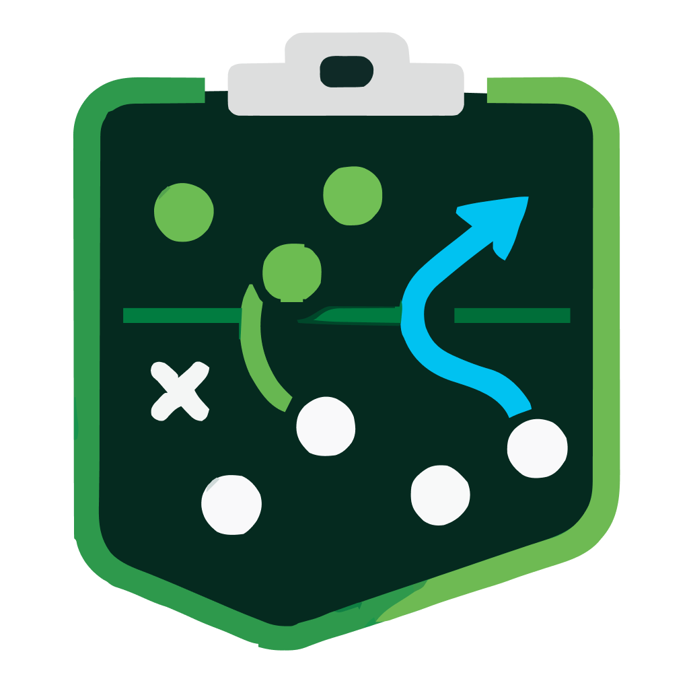

<div align="center">



# FootballManager.IO

**Build your dream club from scratch, rise through the leagues, and become the ultimate football manager.**

Free to play in the browser, on iOS and on Android — pure football strategy, no payments.

### ▶︎ [Play now on footballmanager.io](https://footballmanager.io)

[](https://github.com/dobschal/soccer-manager/actions/workflows/ci.yml)
[](https://footballmanager.io)
[](https://stats.uptimerobot.com/gl1eWD8XkT)
[](https://apps.apple.com/de/app/footballmanager-io/id6759547142)
[](https://play.google.com/store/apps/details?id=io.soccermanager.app)

</div>

---

## The game

You take over a club in the lowest league and work your way up to League 1 — against real
managers, not scripted opponents. Matches are simulated twice a day, so a season plays out
over days, not minutes.

- ⚽️ **Squad & tactics** — line-ups, formations, attack mode, playing style and pass style
- 🏟 **Stadium & buildings** — expand capacity, unlock ticket revenue and better action cards
- 💸 **Finances** — sponsors, salaries, transfer market and player market values
- 🃏 **Action cards** — train players, trigger events, trade cards with other managers
- 🌱 **Youth academy** — scout, train and promote your own talents
- 🏆 **Leagues & cup** — promotion, relegation, cup rounds and AI-generated match reports
- 💬 **Community** — chat, forum and friend feed

Feature specs (mostly German) live in [`requirements/`](requirements/).

## Getting started (developers)

Requirements: **Node.js 20** and **Docker** (for MySQL 8). Versions are pinned in
`Dockerfile` / `docker-compose.yml`.

```bash
npm install                       # install deps (also copies vendor assets)
docker compose up database -d     # start MySQL
DB_HOST=localhost node server/api.js
# → http://localhost:3000
```

Useful commands:

```bash
npm test                          # client + server tests (Vitest)
npm run lint                      # ESLint
npm run ios                       # NativeScript iOS simulator (needs Xcode, server running)
npm run android                   # NativeScript Android emulator
node server/migrate-database.cmd.js   # apply schema migrations
node server/prepare-season.cmd.js     # create leagues, teams and a season
node server/play-game-day.cmd.js      # simulate one game day
```

Project layout:

| Path            | What lives there                                                |
|-----------------|-----------------------------------------------------------------|
| `server/`       | Express API, game simulation, CRON jobs, MySQL access           |
| `client/`       | Vanilla-JS frontend on a custom `UIElement` component framework |
| `native-app/`   | NativeScript shell for the iOS/Android apps                     |
| `requirements/` | Feature specifications                                          |

Architecture notes, conventions and deployment details: [CLAUDE.md](CLAUDE.md).

Branches: `develop` → [sandbox](https://sandbox.footballmanager.io), `main` → production.
Pull requests should target `develop`.

## Contributors

<table>
  <tr>
    <td align="center">
      <a href="https://github.com/dobschal">
        <br>
        <sub><b>dobschal</b></sub>
      </a>
    </td>
    <td align="center">
      <a href="https://github.com/johannesrosenhan89">
        <br>
        <sub><b>johannesrosenhan89</b></sub>
      </a>
    </td>
  </tr>
</table>

## License

The source is public for transparency, learning and contributions — but it is **not** free
software: all rights remain with this repository owner. You may read, fork and build it locally to
contribute, but you may not reuse the code in other projects, host your own instance or
redistribute it. See [LICENSE](LICENSE).
